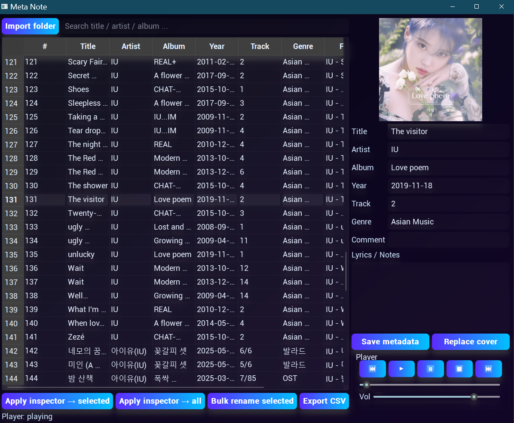

# Meta Note

Meta Note is a Python-based desktop application for managing and editing metadata of audio files. It provides a user-friendly interface to view, modify, and organize audio metadata, including tags like title, artist, album, and lyrics, as well as support for embedded cover art. The application uses PySide6 for the GUI, VLC for audio playback, and Mutagen for handling audio metadata.

## Features

- **Audio Metadata Editing**: Edit tags such as title, artist, album, year, track, genre, comment, and lyrics for audio files.
- **Supported Formats**: Works with common audio formats including MP3, FLAC, M4A, WAV, OGG, and OPUS.
- **Batch Processing**: Apply metadata changes to multiple files at once or rename files based on their metadata.
- **Audio Playback**: Integrated VLC-based audio player with play, pause, stop, next, and previous track controls.
- **Cover Art Management**: View and replace cover art for audio files.
- **CSV Export**: Export metadata of all loaded files to a CSV file for easy sharing or backup.
- **Folder Import**: Scan entire folders for audio files to manage them in bulk.
- **Search Functionality**: Filter audio files by title, artist, or album for quick access.
- **Modern UI**: Sleek, gradient-styled interface with drop-shadow effects for a polished look.

## Screenshot



## Installation

1. **Clone the Repository**:

   ```bash
   git clone https://github.com/your-username/meta-note.git
   cd meta-note
   ```

2. **Install Dependencies**:
   Ensure you have Python 3.8+ installed. Install the required Python packages using pip:

   ```bash
   pip install PySide6 vlc-python mutagen pillow
   ```

3. **Install VLC**:
   The application requires VLC media player to be installed on your system. Download and install VLC from [the official website](https://www.videolan.org/vlc/).

4. **Run the Application**:
   ```bash
   python app.py
   ```

## Usage

1. **Launch the Application**:
   Run `app.py` to open the Meta Note interface.

2. **Import Audio Files**:

   - Click the "Import folder" button to scan a directory for supported audio files.
   - Files will appear in the table view, showing metadata like title, artist, album, and file size.

3. **Edit Metadata**:

   - Double-click a file in the table to load its metadata into the inspector on the right.
   - Modify fields like title, artist, album, year, track, genre, comment, or lyrics.
   - Click "Save metadata" to save changes to the selected file.

4. **Batch Editing**:

   - Select multiple files in the table and click "Apply inspector → selected" to apply metadata changes to all selected files.
   - Use "Apply inspector → all" to apply changes to all loaded files.

5. **Rename Files**:

   - Select files and click "Bulk rename selected" to rename them based on artist and title tags.

6. **Manage Cover Art**:

   - View the current cover art in the inspector.
   - Click "Replace cover" to upload a new image (PNG or JPEG) for the selected file.

7. **Playback**:

   - Use the player controls (play, pause, stop, next, previous) to listen to audio files.
   - Adjust volume and seek through tracks using the sliders.

8. **Export Metadata**:
   - Click "Export CSV" to save metadata of all loaded files to a CSV file.

## Dependencies

- **Python 3.8+**
- **PySide6**: For the graphical user interface.
- **python-vlc**: For audio playback.
- **Mutagen**: For reading and writing audio metadata.
- **Pillow**: For handling cover art images.
- **VLC Media Player**: Required for audio playback.

## Project Structure

- `app.py`: Main application script containing the GUI and logic.
- `Screenshot.png`: Screenshot of the application for documentation.

## Contributing

Contributions are welcome! Please fork the repository and submit a pull request with your changes. Ensure your code follows the existing style and includes appropriate documentation.

## License

This project is licensed under the Apache License. See the [LICENSE](LICENSE) file for details.

## Acknowledgments

- Built with [PySide6](https://doc.qt.io/qtforpython/) for the GUI.
- Uses [Mutagen](https://mutagen.readthedocs.io/) for metadata handling.
- Powered by [VLC](https://www.videolan.org/vlc/) for audio playback.
